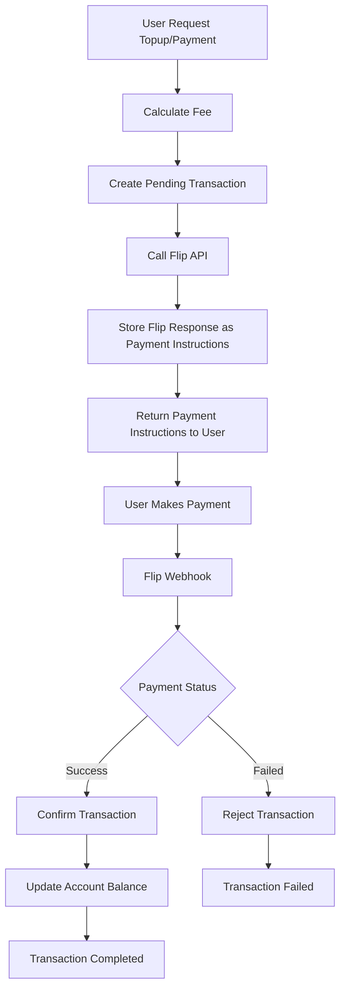
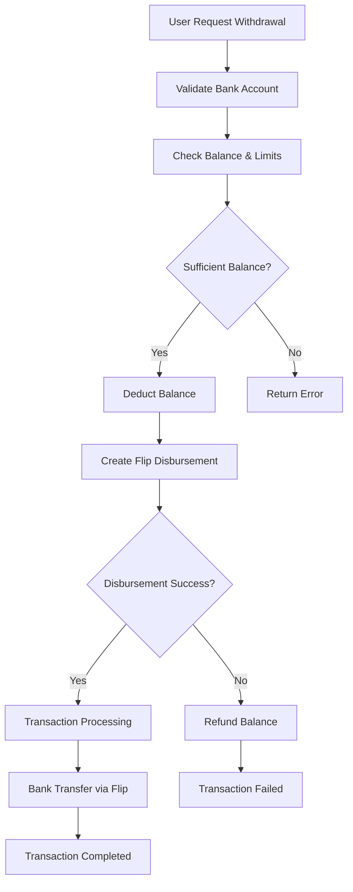

# GSALT Core - API Documentation

## Payment Flow Diagram

### External Payment Flow (QRIS/VA/E-wallet/Credit Card/Retail)



### Withdrawal Flow



## API Documentation

Base URL Development: `http://localhost:8080`
Base URL Production: `https://gsalt-core.safatanc.com`

### Authentication

All endpoints requiring authentication use the `Authorization: Bearer <token>` header, where the token is provided by Safatanc Connect.

---

### Health Check

#### GET /health
Checks the application's health status.
**Response (200 OK):**
```json
{
  "success": true,
  "data": "gsalt-core"
}
```

---

### Account Management

#### POST /accounts
Creates a new GSALT account for an authenticated Safatanc Connect user.
- **Middleware**: `AuthConnect`
- **Request Body**: None
- **Response (201 Created):**
```json
{
    "success": true,
    "data": {
        "connect_id": "c2a9b3a1-5c9e-4b7e-8c6f-3b4a2e1d0c5a",
        "balance": 0,
        "points": 0,
        "account_type": "PERSONAL",
        "status": "ACTIVE",
        "kyc_status": "UNVERIFIED",
        "created_at": "2023-10-27T10:00:00Z",
        "updated_at": "2023-10-27T10:00:00Z"
    }
}
```

#### GET /accounts/me
Gets the current user's account information.
- **Middleware**: `AuthConnect`, `AuthAccount`
- **Response (200 OK):** Same structure as `POST /accounts`

#### DELETE /accounts/me
Deletes the current user's GSALT account.
- **Middleware**: `AuthConnect`, `AuthAccount`
- **Response (200 OK):**
```json
{
    "success": true,
    "data": null
}
```

#### GET /accounts/:id
Gets account information by ID.
- **Middleware**: None (Public)
- **Response (200 OK):** Same structure as `POST /accounts`

---

### Transaction Management

#### Public Transaction Endpoints

#### GET /transactions/:id
Gets a specific transaction by its ID.
- **Middleware**: None (Public)
- **Response (200 OK):**
```json
{
    "success": true,
    "data": {
        "id": "c2a9b3a1-5c9e-4b7e-8c6f-3b4a2e1d0c5a",
        "account_id": "d4e5f6g7-h8i9-0123-4567-890abcdef123",
        "type": "TOPUP",
        "currency": "GSALT",
        "status": "COMPLETED",
        "description": "Top up via QRIS",
        "amount_gsalt_units": 10000,
        "exchange_rate_idr": "15000.00",
        "payment_amount": 150000,
        "payment_currency": "IDR",
        "payment_method": "QRIS",
        "fee_gsalt_units": 100,
        "total_amount_gsalt_units": 10100,
        "payment_status": "COMPLETED",
        "payment_initiated_at": "2024-01-01T10:00:00Z",
        "payment_completed_at": "2024-01-01T10:05:00Z",
        "created_at": "2024-01-01T10:00:00Z",
        "updated_at": "2024-01-01T10:05:00Z",
        "completed_at": "2024-01-01T10:05:00Z",
        "payment_details": {
            "id": "e5f6g7h8-i9j0-1234-5678-90abcdef1234",
            "transaction_id": "c2a9b3a1-5c9e-4b7e-8c6f-3b4a2e1d0c5a",
            "provider": "FLIP",
            "provider_payment_id": "flip-123456",
            "payment_url": "https://flip.id/payment/123456",
            "qr_code": "00020101021226...",
            "expiry_time": "2024-01-01T11:00:00Z",
            "payment_time": "2024-01-01T10:05:00Z",
            "provider_fee_amount": 1000,
            "created_at": "2024-01-01T10:00:00Z",
            "updated_at": "2024-01-01T10:05:00Z"
        }
    }
}
```

#### GET /transactions/ref/:ref
Gets a specific transaction by its reference ID.
- **Middleware**: None (Public)
- **Response (200 OK):** `models.Transaction`

#### POST /transactions/webhook/flip
Handles payment notifications from Flip. This endpoint does not require authentication but should be secured with a webhook secret token.
- **Request Body**: `models.FlipWebhookPayload`
```json
{
    "id": 12345,
    "bill_link_id": 67890,
    "bill_title": "GSALT Topup - ...",
    "status": "SUCCESSFUL",
    "amount": 50000,
    "...": "..."
}
```
- **Response (200 OK):**
```json
{
  "status": "ok"
}
```

#### Protected Transaction Endpoints

#### POST /transactions
Creates a new transaction.
- **Middleware**: `AuthConnect`, `AuthAccount`
- **Request Body**: `models.TransactionCreateRequest`
- **Response (201 Created):** `models.Transaction`

#### GET /transactions
Gets the current user's transaction history with pagination.
- **Middleware**: `AuthConnect`, `AuthAccount`
- **Query Parameters**: 
  - `page` (default: 1)
  - `limit` (default: 10)
  - `order` (asc/desc, default: desc)
  - `order_field` (default: created_at)
- **Response (200 OK):** `models.Pagination[[]models.Transaction]`

#### PUT /transactions/:id
Updates a transaction.
- **Middleware**: `AuthConnect`, `AuthAccount`
- **Request Body**: `models.TransactionUpdateRequest`
- **Response (200 OK):** `models.Transaction`

#### Transaction Operations

#### POST /transactions/topup
Processes a balance top-up request.
- **Middleware**: `AuthConnect`, `AuthAccount`
- **Request Body**: `models.TopupRequest`
```json
{
    "amount_gsalt": "100.00",
    "payment_amount": 150000,
    "payment_currency": "IDR",
    "payment_method": "QRIS",
    "external_reference_id": "optional-reference",
    "payment_details": {
        "provider": "FLIP",
        "payment_url": "https://flip.id/payment/123456",
        "expiry_time": "2024-01-01T11:00:00Z"
    }
}
```

#### POST /transactions/transfer
Transfers GSALT balance between two accounts.
- **Middleware**: `AuthConnect`, `AuthAccount`
- **Request Body**: `models.TransferRequest`
```json
{
    "destination_account_id": "d4e5f6g7-h8i9-0123-4567-890abcdef123",
    "amount_gsalt": "50.00",
    "description": "Payment for services"
}
```

#### POST /transactions/payment
Processes a payment.
- **Middleware**: `AuthConnect`, `AuthAccount`
- **Request Body**: `models.PaymentRequest`
```json
{
    "account_id": "c2a9b3a1-5c9e-4b7e-8c6f-3b4a2e1d0c5a",
    "amount_gsalt_units": 10000,
    "payment_method": "QRIS",
    "customer_name": "John Doe",
    "customer_email": "john.doe@example.com",
    "customer_phone": "+6281234567890",
    "customer_address": "Jakarta, Indonesia",
    "redirect_url": "https://example.com/payment/callback",
    "payment_details": {
        "provider": "FLIP",
        "payment_url": "https://flip.id/payment/123456",
        "expiry_time": "2024-01-01T11:00:00Z"
    }
}
```

#### GET /transactions/ref/:ref
Gets a specific transaction by its reference ID.
- **Middleware**: None (Public)
- **Response (200 OK):** `models.Transaction`

#### POST /transactions/:id/confirm
Confirms a pending payment transaction. Typically used by webhooks or admin panels.
- **Middleware**: `AuthConnect` (or none if purely for webhooks)
- **Request Body**: `models.ConfirmPaymentRequest`
```json
{
  "external_payment_id": "flip-payment-id-123"
}
```
- **Response (200 OK):** Updated `models.Transaction` with "COMPLETED" status.

#### POST /transactions/:id/reject
Rejects a pending payment transaction.
- **Middleware**: `AuthConnect` (or none if for webhooks)
- **Request Body**: `models.RejectPaymentRequest`
```json
{
  "reason": "Payment expired"
}
```
- **Response (200 OK):** Updated `models.Transaction` with "FAILED" status.

---

### Withdrawal Management

#### POST /transactions/withdrawal
Processes a withdrawal request.
- **Middleware**: `AuthConnect`, `AuthAccount`
- **Request Body**: `models.WithdrawalRequest`
```json
{
    "amount_gsalt": "1000.00",
    "bank_code": "bca",
    "account_number": "1234567890",
    "recipient_name": "John Doe",
    "description": "Withdrawal to BCA",
    "external_reference_id": "optional-reference"
}
```
- **Response (200 OK):** `models.WithdrawalResponse`
```json
{
    "success": true,
    "data": {
        "transaction": {
            "id": "c2a9b3a1-5c9e-4b7e-8c6f-3b4a2e1d0c5a",
            "type": "WITHDRAWAL",
            "status": "PROCESSING",
            "amount_gsalt_units": 100000,
            "fee_gsalt_units": 1000,
            "total_amount_gsalt_units": 101000
        },
        "disbursement_id": "flip-disbursement-123",
        "estimated_time": "1-3 business days",
        "status": "PROCESSING"
    }
}
```

#### GET /transactions/withdrawal/banks
Gets the list of supported banks for withdrawal from Flip.
- **Middleware**: `AuthConnect`, `AuthAccount`
- **Response (200 OK):** `[]models.BankListResponse`

#### POST /transactions/withdrawal/validate-bank-account
Validates a bank account number using Flip's inquiry service.
- **Middleware**: `AuthConnect`, `AuthAccount`
- **Request Body**: `models.BankAccountInquiryRequest`
```json
{
  "bank_code": "bca",
  "account_number": "1234567890"
}
```
- **Response (200 OK):** `models.BankAccountInquiryResponse`

#### GET /transactions/withdrawal/balance
Gets the available balance for withdrawal (total balance minus pending withdrawals).
- **Middleware**: `AuthConnect`, `AuthAccount`
- **Response (200 OK):**
```json
{
    "success": true,
    "data": {
        "balance_gsalt_units": 95000,
        "balance_gsalt": "950.00",
        "balance_idr": "950000.00"
    }
}
```

#### GET /transactions/withdrawal/:id/status
Checks the status of a specific withdrawal transaction.
- **Middleware**: `AuthConnect`, `AuthAccount`
- **Response (200 OK):** `models.WithdrawalResponse`

---

### Voucher Management

#### GET /vouchers
Gets a list of all available vouchers with pagination.
- **Middleware**: None (Public)
- **Query Parameters**: 
  - `page` (default: 1)
  - `limit` (default: 10)
  - `order` (asc/desc, default: desc)
  - `order_field` (default: created_at)
  - `status` (optional): Filter by status (ACTIVE/INACTIVE/REDEEMED/EXPIRED)
- **Response (200 OK):**
```json
{
    "success": true,
    "data": {
        "items": [
            {
                "id": "c2a9b3a1-5c9e-4b7e-8c6f-3b4a2e1d0c5a",
                "code": "WELCOME2024",
                "name": "Welcome Bonus",
                "description": "New user welcome bonus",
                "type": "BALANCE",
                "value": "10.00",
                "currency": "GSALT",
                "max_redeem_count": 1000,
                "current_redeem_count": 0,
                "valid_from": "2024-01-01T00:00:00Z",
                "valid_until": "2024-12-31T23:59:59Z",
                "status": "ACTIVE",
                "created_at": "2024-01-01T00:00:00Z",
                "updated_at": "2024-01-01T00:00:00Z"
            }
        ],
        "total": 1,
        "page": 1,
        "limit": 10,
        "total_pages": 1
    }
}
```

#### GET /vouchers/:id
Gets a specific voucher by ID.
- **Middleware**: None (Public)
- **Response (200 OK):** Single voucher object (same structure as in list)

#### GET /vouchers/code/:code
Gets a specific voucher by code.
- **Middleware**: None (Public)
- **Response (200 OK):** Single voucher object

#### POST /vouchers/validate/:code
Validates a voucher code without redeeming it.
- **Middleware**: None (Public)
- **Response (200 OK):**
```json
{
    "success": true,
    "data": {
        "valid": true,
        "voucher": { "... voucher object ..." }
    }
}
```

#### POST /vouchers
Creates a new voucher.
- **Middleware**: `AuthConnect`, `AuthAccount`
- **Request Body**: `models.VoucherCreateRequest`
```json
{
    "code": "WELCOME2024",
    "name": "Welcome Bonus",
    "description": "New user welcome bonus",
    "type": "BALANCE",
    "value": "10.00",
    "currency": "GSALT",
    "max_redeem_count": 1000,
    "valid_from": "2024-01-01T00:00:00Z",
    "valid_until": "2024-12-31T23:59:59Z"
}
```
- **Response (201 Created):**
```json
{
    "success": true,
    "data": {
        "id": "c2a9b3a1-5c9e-4b7e-8c6f-3b4a2e1d0c5a",
        "code": "WELCOME2024",
        "name": "Welcome Bonus",
        "description": "New user welcome bonus",
        "type": "BALANCE",
        "value": "10.00",
        "currency": "GSALT",
        "max_redeem_count": 1000,
        "current_redeem_count": 0,
        "valid_from": "2024-01-01T00:00:00Z",
        "valid_until": "2024-12-31T23:59:59Z",
        "status": "ACTIVE",
        "created_at": "2024-01-01T00:00:00Z",
        "updated_at": "2024-01-01T00:00:00Z"
    }
}
```

#### PATCH /vouchers/:id
Updates an existing voucher.
- **Middleware**: `AuthConnect`, `AuthAccount`
- **Request Body**: `models.VoucherUpdateRequest` (similar to create, all fields optional)
- **Response (200 OK):** Updated voucher object

#### DELETE /vouchers/:id
Deletes a voucher.
- **Middleware**: `AuthConnect`, `AuthAccount`
- **Response (200 OK):**
```json
{
    "success": true,
    "data": null
}
```

---

### Voucher Redemption

#### POST /voucher-redemptions/redeem
Redeems a voucher.
- **Middleware**: `AuthConnect`, `AuthAccount`
- **Request Body**: `models.VoucherRedeemRequest`
```json
{
    "code": "WELCOME2024",
    "account_id": "d4e5f6g7-h8i9-0123-4567-890abcdef123"
}
```
- **Response (200 OK):**
```json
{
    "success": true,
    "data": {
        "redemption": {
            "id": "c2a9b3a1-5c9e-4b7e-8c6f-3b4a2e1d0c5a",
            "voucher_id": "b1a2c3d4-e5f6-7890-1234-567890abcdef",
            "account_id": "d4e5f6g7-h8i9-0123-4567-890abcdef123",
            "redeemed_at": "2024-01-01T12:00:00Z",
            "status": "COMPLETED"
        },
        "transaction": {
            "id": "e5f6g7h8-i9j0-1234-5678-90abcdef1234",
            "type": "VOUCHER_REDEMPTION",
            "status": "COMPLETED",
            "amount_gsalt_units": 1000,
            "voucher_code": "WELCOME2024",
            "created_at": "2024-01-01T12:00:00Z",
            "completed_at": "2024-01-01T12:00:00Z"
        }
    }
}
```

#### GET /voucher-redemptions/me
Gets the current user's voucher redemption history.
- **Middleware**: `AuthConnect`, `AuthAccount`
- **Query Parameters**: 
  - `page` (default: 1)
  - `limit` (default: 10)
  - `order` (asc/desc, default: desc)
  - `order_field` (default: redeemed_at)
- **Response (200 OK):**
```json
{
    "success": true,
    "data": {
        "items": [
            {
                "id": "c2a9b3a1-5c9e-4b7e-8c6f-3b4a2e1d0c5a",
                "voucher_id": "b1a2c3d4-e5f6-7890-1234-567890abcdef",
                "voucher_code": "WELCOME2024",
                "account_id": "d4e5f6g7-h8i9-0123-4567-890abcdef123",
                "redeemed_at": "2024-01-01T12:00:00Z",
                "status": "COMPLETED",
                "transaction_id": "e5f6g7h8-i9j0-1234-5678-90abcdef1234"
            }
        ],
        "total": 1,
        "page": 1,
        "limit": 10,
        "total_pages": 1
    }
}
```

#### GET /voucher-redemptions/:id
Gets details of a specific voucher redemption.
- **Middleware**: `AuthConnect`, `AuthAccount`
- **Response (200 OK):** Single redemption object (same structure as in list)

#### GET /voucher-redemptions/voucher/:voucher_id
Gets all redemptions for a specific voucher.
- **Middleware**: `AuthConnect`, `AuthAccount`
- **Query Parameters**: Same as GET /voucher-redemptions/me
- **Response (200 OK):** Same structure as GET /voucher-redemptions/me

#### PATCH /voucher-redemptions/:id
Updates a voucher redemption (typically for admin purposes).
- **Middleware**: `AuthConnect`, `AuthAccount`
- **Request Body**:
```json
{
    "status": "CANCELLED",
    "notes": "Cancelled due to system error"
}
```
- **Response (200 OK):** Updated redemption object

#### DELETE /voucher-redemptions/:id
Deletes a voucher redemption (typically for admin purposes).
- **Middleware**: `AuthConnect`, `AuthAccount`
- **Response (200 OK):**
```json
{
    "success": true,
    "data": null
}
```

---

### Payment Methods

#### GET /transactions/payment-methods
Gets a list of available payment methods.
- **Middleware**: `AuthConnect`, `AuthAccount`
- **Query Parameters**: 
  - `currency` (optional): Filter by currency (e.g., "IDR", "GSALT")
  - `is_active` (optional): Filter by active status (true/false)
  - `is_available_for_topup` (optional): Filter methods available for top-up (true/false)
  - `is_available_for_withdrawal` (optional): Filter methods available for withdrawal (true/false)
- **Response (200 OK):**
```json
{
    "success": true,
    "data": [
        {
            "id": "c2a9b3a1-5c9e-4b7e-8c6f-3b4a2e1d0c5a",
            "name": "QRIS Payment",
            "code": "QRIS",
            "currency": "IDR",
            "method_type": "QRIS",
            "provider_code": "FLIP",
            "payment_fee_flat": 1000,
            "payment_fee_percent": "0.70",
            "withdrawal_fee_flat": 0,
            "withdrawal_fee_percent": "0.00",
            "is_active": true,
            "is_available_for_topup": true,
            "is_available_for_withdrawal": false,
            "created_at": "2024-01-01T00:00:00Z",
            "updated_at": "2024-01-01T00:00:00Z"
        }
    ]
}
```

### API Key Management

#### POST /api-keys
Creates a new API key.
- **Middleware**: `AuthConnect`, `AuthAccount`
- **Request Body**: `models.APIKeyCreateRequest`
```json
{
    "key_name": "Production API Key",
    "scopes": ["READ", "WRITE", "PAYMENT"],
    "rate_limit": 1000,
    "expires_at": "2025-01-01T00:00:00Z"
}
```
- **Response (201 Created):**
```json
{
    "success": true,
    "data": {
        "id": "c2a9b3a1-5c9e-4b7e-8c6f-3b4a2e1d0c5a",
        "merchant_id": "a1b2c3d4-e5f6-7890-1234-567890abcdef",
        "key_name": "Production API Key",
        "api_key": "gsalt_prod_1234567890abcdef",
        "prefix": "gsalt_prod_",
        "scopes": ["READ", "WRITE", "PAYMENT"],
        "rate_limit": 1000,
        "expires_at": "2025-01-01T00:00:00Z",
        "created_at": "2024-01-01T00:00:00Z",
        "updated_at": "2024-01-01T00:00:00Z"
    }
}
```

#### GET /api-keys
Lists all API keys.
- **Middleware**: `AuthConnect`, `AuthAccount`
- **Response (200 OK):**
```json
{
    "success": true,
    "data": [
        {
            "id": "c2a9b3a1-5c9e-4b7e-8c6f-3b4a2e1d0c5a",
            "merchant_id": "a1b2c3d4-e5f6-7890-1234-567890abcdef",
            "key_name": "Production API Key",
            "prefix": "gsalt_prod_",
            "scopes": ["READ", "WRITE", "PAYMENT"],
            "rate_limit": 1000,
            "last_used_at": "2024-01-01T12:00:00Z",
            "expires_at": "2025-01-01T00:00:00Z",
            "created_at": "2024-01-01T00:00:00Z",
            "updated_at": "2024-01-01T00:00:00Z"
        }
    ]
}
```

#### PATCH /api-keys/:id
Updates an API key.
- **Middleware**: `AuthConnect`, `AuthAccount`
- **Request Body**: `models.APIKeyUpdateRequest`
```json
{
    "key_name": "Updated API Key Name",
    "scopes": ["READ", "WRITE"],
    "rate_limit": 500,
    "expires_at": "2025-06-01T00:00:00Z"
}
```

### Error Responses

All error responses follow this format:
```json
{
    "success": false,
    "error": {
        "code": "ERROR_CODE",
        "message": "Human readable error message",
        "details": {
            "field": "validation error details"
        }
    }
}
```

Common error codes:
- `INVALID_REQUEST`: Request validation failed
- `UNAUTHORIZED`: Missing or invalid authentication
- `FORBIDDEN`: Insufficient permissions
- `NOT_FOUND`: Resource not found
- `CONFLICT`: Resource conflict
- `TOO_MANY_REQUESTS`: Rate limit exceeded
- `INTERNAL_ERROR`: Internal server error

### Authentication Headers

The API supports two authentication methods:

1. **Connect Token Authentication**
```http
Authorization: Bearer <connect_token>
```

2. **API Key Authentication**
```http
X-API-Key: gsalt_prod_1234567890abcdef
```

### Rate Limiting

The API implements rate limiting based on different factors:

1. **IP-based Rate Limiting** (Public API)
   - Default limit: 100 requests per minute
   - Headers:
     ```http
     X-RateLimit-Limit: 100
     X-RateLimit-Remaining: 95
     X-RateLimit-Reset: 1704067200
     ```

2. **User-based Rate Limiting** (Authenticated API)
   - Default limit: 1000 requests per minute
   - Same headers as IP-based rate limiting

3. **API Key Rate Limiting** (Merchant API)
   - Limit specified during API key creation
   - Same headers as IP-based rate limiting

When rate limit is exceeded:
```json
{
    "success": false,
    "error": {
        "code": "TOO_MANY_REQUESTS",
        "message": "Rate limit exceeded",
        "limit": 100,
        "reset": 1704067200
    }
}
```