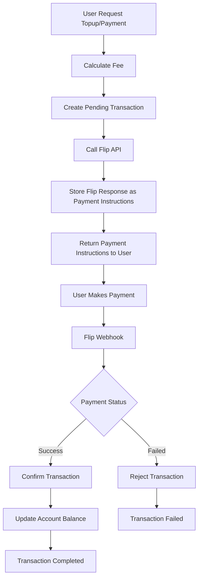
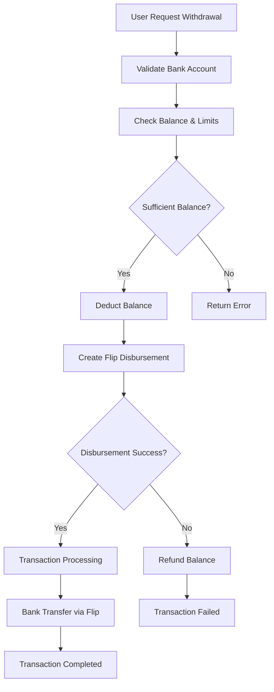

# GSALT Core - API Documentation

## Payment Flow Diagram

### External Payment Flow (QRIS/VA/E-wallet/Credit Card/Retail)



### Withdrawal Flow



## API Documentation

Base URL Development: `http://localhost:8080`
Base URL Production: `https://gsalt-core.safatanc.com`

### Authentication

All endpoints requiring authentication use the `Authorization: Bearer <token>` header, where the token is provided by Safatanc Connect.

---

### Health Check

#### GET /health
Checks the application's health status.
**Response (200 OK):**
```json
{
  "success": true,
  "data": "gsalt-core"
}
```

---

### Account Management

#### POST /accounts
Creates a new GSALT account for an authenticated Safatanc Connect user.
- **Middleware**: `AuthConnect`
- **Request Body**: None
- **Response (201 Created):** `models.Account`
```json
{
    "success": true,
    "data": {
        "connect_id": "c2a9b3a1-5c9e-4b7e-8c6f-3b4a2e1d0c5a",
        "balance": 0,
        "points": 0,
        "created_at": "2023-10-27T10:00:00Z",
        "updated_at": "2023-10-27T10:00:00Z"
    }
}
```

#### GET /accounts/me
Gets the current user's account information.
- **Middleware**: `AuthConnect`, `AuthAccount`
- **Response (200 OK):** `models.Account` (Same structure as `POST /accounts`)

---

### Transaction Management

#### POST /transactions/topup
Processes a balance top-up request. Creates a pending transaction and returns payment instructions from Flip.
- **Middleware**: `AuthConnect`, `AuthAccount`
- **Request Body**: `models.TopupRequest`
```json
{
  "amount_gsalt": "100.00",
  "payment_method": "QRIS"
}
```
- **Response (200 OK):** `models.TopupResponse`
```json
{
    "success": true,
    "data": {
        "transaction": {
            "id": "f47ac10b-58cc-4372-a567-0e02b2c3d479",
            "account_id": "c2a9b3a1-5c9e-4b7e-8c6f-3b4a2e1d0c5a",
            "type": "TOPUP",
            "amount_gsalt_units": 10000,
            "status": "PENDING",
            "payment_method": "QRIS",
            "external_payment_id": "227124",
            "payment_instructions": "{\"link_id\":227124,\"link_url\":\"...\",\"status\":\"INACTIVE\",...}"
        },
        "payment_instructions": {
            "link_id": 227124,
            "link_url": "flip.id/pwf-sandbox/$safatanctechnologydigital/#...",
            "payment_url": "flip.id/pwf-sandbox/$safatanctechnologydigital/#...",
            "status": "INACTIVE",
            "customer": { "name": "...", "email": "...", "phone": "..." },
            "instructions": "Scan kode QR untuk pembayaran"
        }
    }
}
```
*Note: `payment_instructions` in the response contains the full, deserialized JSON object from Flip for frontend use. The `transaction.payment_instructions` field stores this same object as a raw JSON string.*

#### POST /transactions/transfer
Transfers GSALT balance between two accounts.
- **Middleware**: `AuthConnect`, `AuthAccount`
- **Request Body**: `models.TransferRequest`
```json
{
  "destination_account_id": "a1b2c3d4-e5f6-7890-1234-567890abcdef",
  "amount_gsalt": "50.00",
  "description": "Payment for services"
}
```
- **Response (200 OK):**
```json
{
    "success": true,
    "data": {
        "transfer_out": { "... transaction details ..." },
        "transfer_in": { "... transaction details ..." }
    }
}
```

#### POST /transactions/payment
Processes a payment using either GSALT balance or an external payment method via Flip.
- **Middleware**: `AuthConnect`, `AuthAccount`
- **Request Body**: `models.PaymentRequest`
```json
{
  "account_id": "c2a9b3a1-5c9e-4b7e-8c6f-3b4a2e1d0c5a",
  "amount_gsalt_units": 10000,
  "payment_method": "QRIS",
  "customer_name": "John Doe",
  "customer_email": "john.doe@example.com"
}
```
- **Response (200 OK):** `models.PaymentResponse`. The structure is similar to the Top-up response, providing payment details from Flip.

#### GET /transactions
Gets the current user's transaction history with pagination.
- **Middleware**: `AuthConnect`, `AuthAccount`
- **Query Parameters**: `page`, `limit`, `order`, `order_field`
- **Response (200 OK):** `models.Pagination[[]models.Transaction]`

#### GET /transactions/:id
Gets a specific transaction by its ID.
- **Middleware**: `AuthConnect`, `AuthAccount`
- **Response (200 OK):** `models.Transaction`

#### POST /transactions/:id/confirm
Confirms a pending payment transaction. Typically used by webhooks or admin panels.
- **Middleware**: `AuthConnect` (or none if purely for webhooks)
- **Request Body**: `models.ConfirmPaymentRequest`
```json
{
  "external_payment_id": "flip-payment-id-123"
}
```
- **Response (200 OK):** Updated `models.Transaction` with "COMPLETED" status.

#### POST /transactions/:id/reject
Rejects a pending payment transaction.
- **Middleware**: `AuthConnect` (or none if for webhooks)
- **Request Body**: `models.RejectPaymentRequest`
```json
{
  "reason": "Payment expired"
}
```
- **Response (200 OK):** Updated `models.Transaction` with "FAILED" status.

---

### Withdrawal Management

#### POST /transactions/withdrawal
Processes a withdrawal request from GSALT balance to an Indonesian bank account via Flip.
- **Middleware**: `AuthConnect`, `AuthAccount`
- **Request Body**: `models.WithdrawalRequest`
```json
{
  "amount_gsalt": "1000.00",
  "bank_code": "bca",
  "account_number": "1234567890",
  "recipient_name": "John Doe"
}
```
- **Response (200 OK):** `models.WithdrawalResponse`
```json
{
    "success": true,
    "data": {
        "transaction": { "... transaction details with PENDING status ..." },
        "disbursement_id": "flip-disbursement-id-123",
        "status": "PENDING",
        "estimated_time": "1-3 business days"
    }
}
```

#### GET /transactions/withdrawal/banks
Gets the list of supported banks for withdrawal from Flip.
- **Middleware**: `AuthConnect`, `AuthAccount`
- **Response (200 OK):** `[]models.BankListResponse`

#### POST /transactions/withdrawal/validate-bank-account
Validates a bank account number using Flip's inquiry service.
- **Middleware**: `AuthConnect`, `AuthAccount`
- **Request Body**: `models.BankAccountInquiryRequest`
```json
{
  "bank_code": "bca",
  "account_number": "1234567890"
}
```
- **Response (200 OK):** `models.BankAccountInquiryResponse`

#### GET /transactions/withdrawal/balance
Gets the available balance for withdrawal (total balance minus pending withdrawals).
- **Middleware**: `AuthConnect`, `AuthAccount`
- **Response (200 OK):**
```json
{
    "success": true,
    "data": {
        "available_balance": 95000 
    }
}
```

#### GET /transactions/withdrawal/:id/status
Checks the status of a specific withdrawal transaction.
- **Middleware**: `AuthConnect`, `AuthAccount`
- **Response (200 OK):** `models.WithdrawalResponse`

---

### Voucher & Redemption

#### GET /vouchers
Gets a list of all available vouchers with pagination.
- **Middleware**: None (Public)
- **Query Parameters**: `page`, `limit`, `status`, etc.
- **Response (200 OK):** `models.Pagination[[]models.Voucher]`

#### POST /voucher-redemptions/redeem
Redeems a voucher, which creates a transaction to credit the user's account.
- **Middleware**: `AuthConnect`, `AuthAccount`
- **Request Body**:
```json
{
  "voucher_code": "WELCOME2024"
}
```
- **Response (200 OK):**
```json
{
    "success": true,
    "data": {
        "redemption": { "... models.VoucherRedemption ..." },
        "transaction": { "... models.Transaction ..." }
    }
}
```

---

### Webhook Endpoints

#### POST /webhooks/flip
Handles payment notifications from Flip. This endpoint does not require authentication but should be secured with a webhook secret token.
- **Request Body**: `models.FlipWebhookPayload`
```json
{
    "id": 12345,
    "bill_link_id": 67890,
    "bill_title": "GSALT Topup - ...",
    "status": "SUCCESSFUL",
    "amount": 50000,
    "...": "..."
}
```
- **Response (200 OK):**
```json
{
  "status": "ok"
}
```
The service will find the corresponding transaction using the `bill_link_id` (stored as `external_payment_id`) and update its status to "COMPLETED" or "FAILED".

### API Key Management

#### POST /api-keys
Creates a new API key for a merchant.
- **Middleware**: `AuthConnect`, `AuthAccount`
- **Request Body**: `models.APIKeyCreateRequest`
```json
{
  "key_name": "Production API Key",
  "scopes": ["READ", "WRITE", "PAYMENT"],
  "rate_limit": 1000,
  "expires_at": "2025-01-01T00:00:00Z"
}
```
- **Response (201 Created):**
```json
{
    "success": true,
    "data": {
        "id": "c2a9b3a1-5c9e-4b7e-8c6f-3b4a2e1d0c5a",
        "merchant_id": "a1b2c3d4-e5f6-7890-1234-567890abcdef",
        "key_name": "Production API Key",
        "api_key": "gsalt_prod_1234567890abcdef",
        "prefix": "gsalt_prod_",
        "scopes": ["READ", "WRITE", "PAYMENT"],
        "rate_limit": 1000,
        "expires_at": "2025-01-01T00:00:00Z",
        "created_at": "2024-01-01T00:00:00Z",
        "updated_at": "2024-01-01T00:00:00Z"
    }
}
```

#### GET /api-keys
Lists all API keys for the authenticated merchant.
- **Middleware**: `AuthConnect`, `AuthAccount`
- **Response (200 OK):**
```json
{
    "success": true,
    "data": [
        {
            "id": "c2a9b3a1-5c9e-4b7e-8c6f-3b4a2e1d0c5a",
            "merchant_id": "a1b2c3d4-e5f6-7890-1234-567890abcdef",
            "key_name": "Production API Key",
            "prefix": "gsalt_prod_",
            "scopes": ["READ", "WRITE", "PAYMENT"],
            "rate_limit": 1000,
            "last_used_at": "2024-01-01T12:00:00Z",
            "expires_at": "2025-01-01T00:00:00Z",
            "created_at": "2024-01-01T00:00:00Z",
            "updated_at": "2024-01-01T00:00:00Z"
        }
    ]
}
```

#### PATCH /api-keys/:id
Updates an existing API key.
- **Middleware**: `AuthConnect`, `AuthAccount`
- **Request Body**: `models.APIKeyUpdateRequest`
```json
{
  "key_name": "Updated API Key Name",
  "scopes": ["READ", "WRITE"],
  "rate_limit": 500,
  "expires_at": "2025-06-01T00:00:00Z"
}
```
- **Response (200 OK):** Same structure as GET /api-keys response for a single key

#### DELETE /api-keys/:id
Revokes an API key.
- **Middleware**: `AuthConnect`, `AuthAccount`
- **Response (200 OK):**
```json
{
    "success": true,
    "data": null
}
```

### Rate Limiting

The API implements rate limiting based on different factors:

1. **IP-based Rate Limiting** (Public API)
   - Applies to all public endpoints
   - Default limit: Configurable per environment
   - Headers returned:
     - `X-RateLimit-Limit`: Maximum requests per window
     - `X-RateLimit-Remaining`: Remaining requests in current window
     - `X-RateLimit-Reset`: Unix timestamp when the rate limit resets

2. **User-based Rate Limiting** (Authenticated API)
   - Applies to endpoints requiring authentication
   - Limit tied to user account
   - Same headers as IP-based rate limiting

3. **API Key Rate Limiting** (Merchant API)
   - Applies when using API key authentication
   - Limit specified during API key creation
   - Same headers as IP-based rate limiting

When rate limit is exceeded, the API returns:
- **Status**: 429 Too Many Requests
- **Response Body**:
```json
{
    "success": false,
    "error": {
        "code": "TOO_MANY_REQUESTS",
        "message": "Rate limit exceeded",
        "limit": 100,
        "reset": 1704067200
    }
}
```

### Authentication Headers

The API supports two authentication methods:

1. **Connect Token Authentication**
   ```
   Authorization: Bearer <connect_token>
   ```

2. **API Key Authentication**
   ```
   X-API-Key: gsalt_prod_1234567890abcdef
   ```